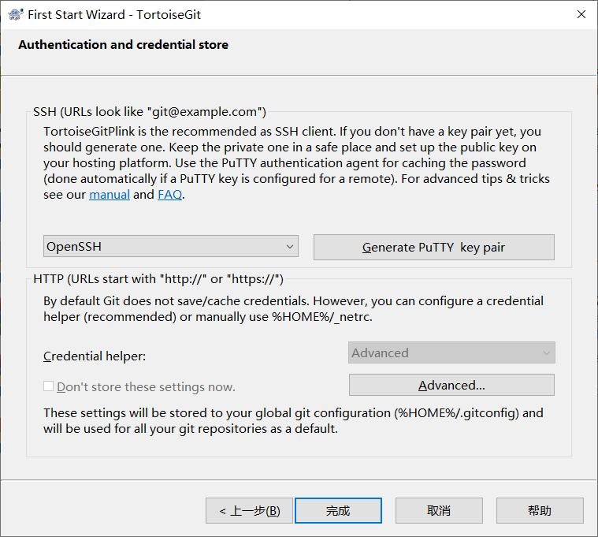
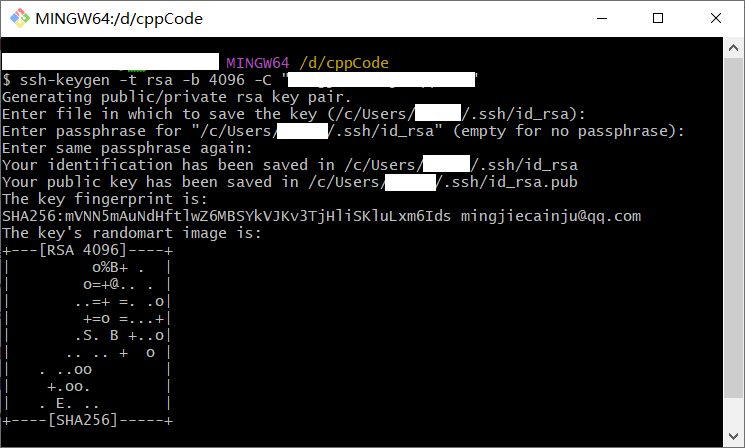
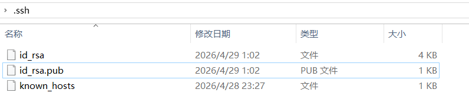
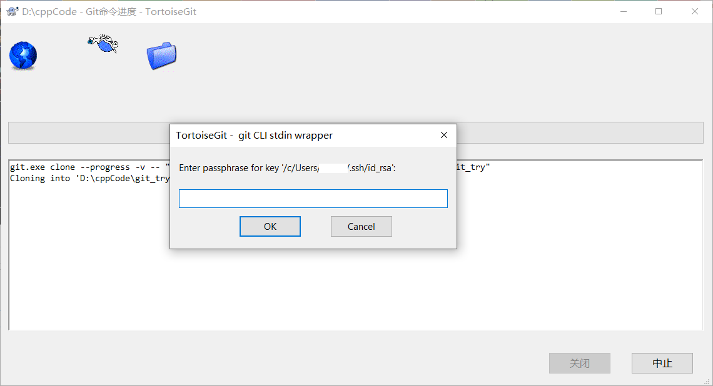
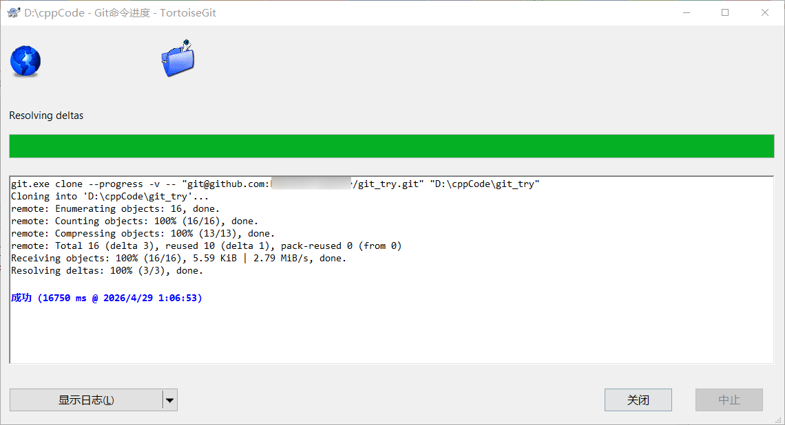

# OpenSSH演示

1、配置tortoiseGit时，选择**OpenSSH**

2、配置完成后，在git bash中生成密钥
`ssh-keygen -t rsa -b 4096 -C "youremail@xx.com"`生成密钥对，设置密码

3、密钥对默认存放于`C:\Users\username\.ssh`文件夹下，将.pub后缀的公钥文件以文本形式打开，复制内容并添加到github上

4、尝试SSH clone一个仓库，需要输入私钥密码

克隆成功
