# TortoiseGitPlink演示
1、使用如下两个版本的安装包，3为git安装包，1为tortoiseGit安装包，2为tortoiseGit的中文语言包

2、首先安装git，选择合适的路径

3、后续选项均可选择默认值，安装完毕后目录内容如下（putty文件夹除外）
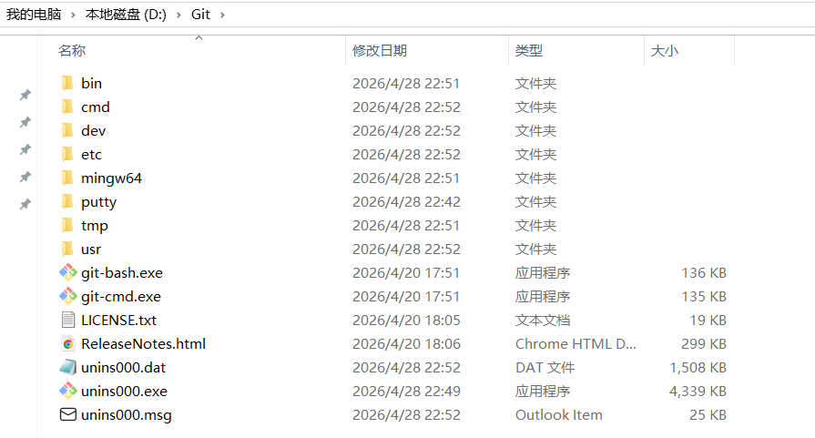

4、安装tortoiseGit，可选择和git在同一主目录下  
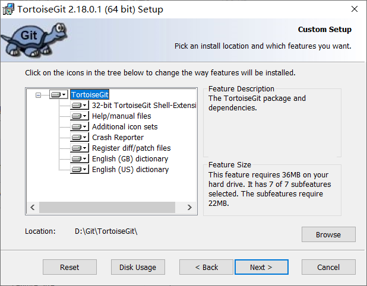

5、安装好后会跳出如下页面，我们返回安装中文语言包，安装好后点refresh即显示中文可选

6、这里设置git的名称和电子邮箱，作为提交时的身份标识
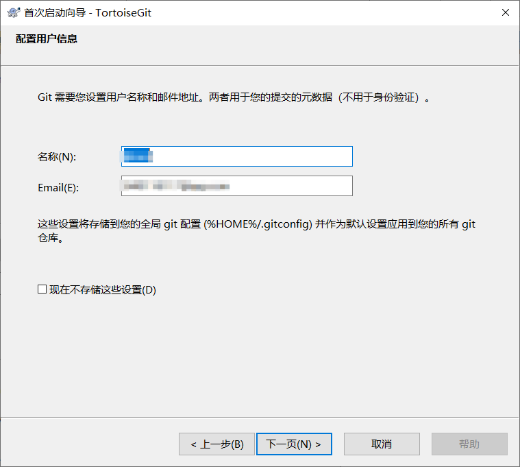

7、此处选择**TortoiseGitPlink**，然后生成PuTTY密钥对
(OpenSSH认证见[link](./git_local_deployment_SSH.md))
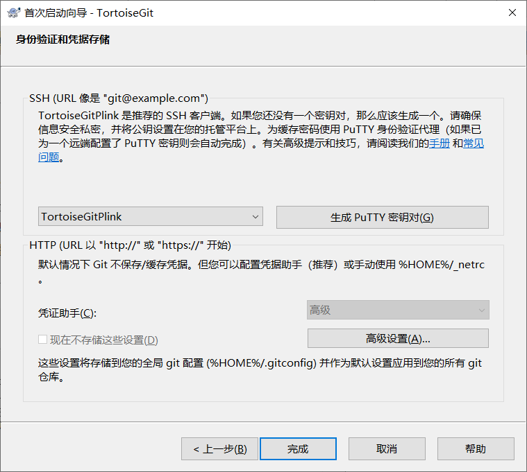  
点击generate，然后按照要求随机移动鼠标，依据鼠标轨迹随机生成密钥对
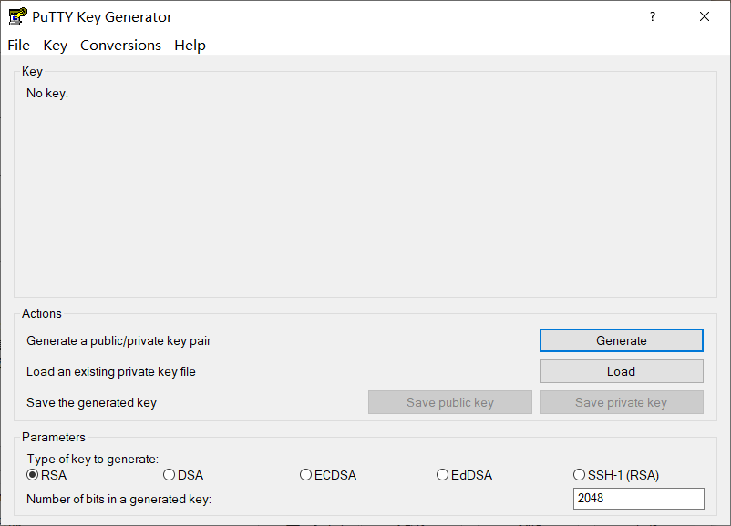
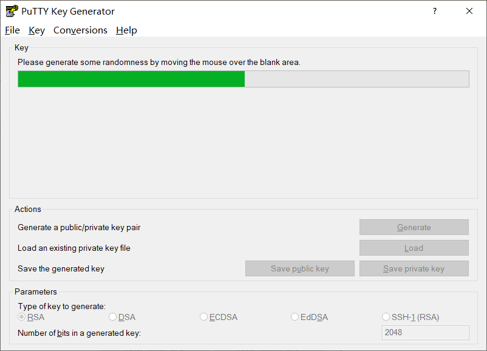

然后就生成了一对密钥，下图大方框为OpenSSH格式的公钥，第二个框内为其对应的SHA256码。  
生成完毕后可以设置私钥密码，然后分别保存公钥和私钥，文件名自己命名，一般为id_rsa。私钥不要暴露在网络上。  
注意保存后的公钥用文本格式打开是**SSH2**的格式，与github网站的**OpenSSH**要求不符，我们需要重新在PuTTYGen中load .ppk后缀的私钥，然后复制大方框中的公钥文本至github的SSHkeys中（不要带上最后的comment）。
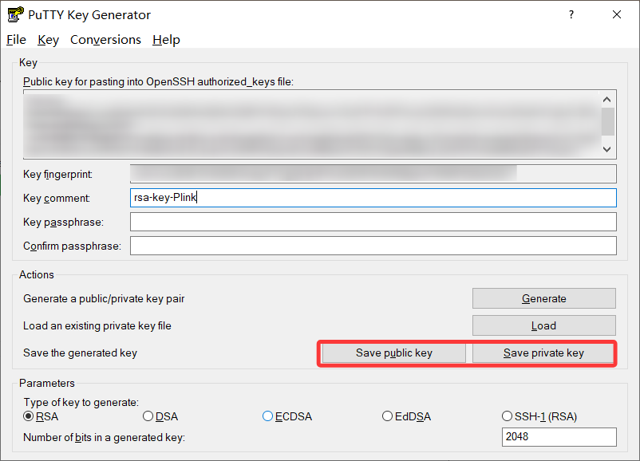

ppk后缀的为私钥，另一个为公钥

随后返回TortoiseGit安装向导点击完成，安装完毕

8、在TortoiseGit的设置中网络页面可以看到，使用的SSH客户端为TortoiseGitPlink
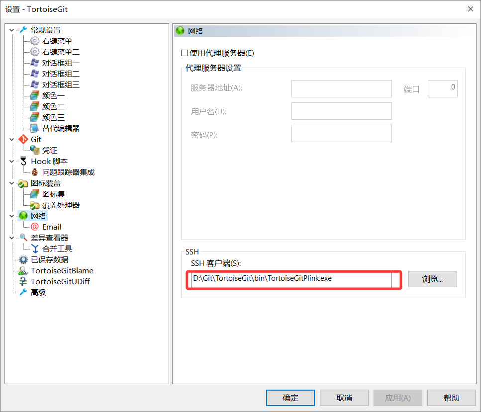

9、打开github，进入一个仓库，尝试用SSH来clone，发现显示github账户无公钥，点击链接添加公钥
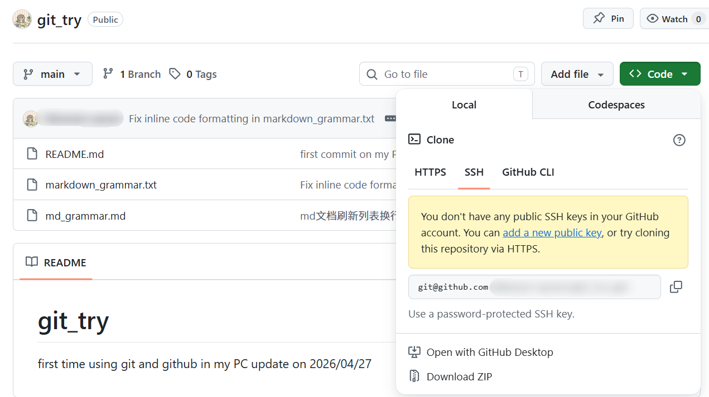

将刚刚PuTTYGen中生成的OpenSSH格式的公钥复制并添加，一定是以ssh-rsa开头

10、添加完公钥后，在任务栏搜索pageant并打开，点击add key导入之前生成的.ppk私钥，这样就可以和github上的公钥进行链接
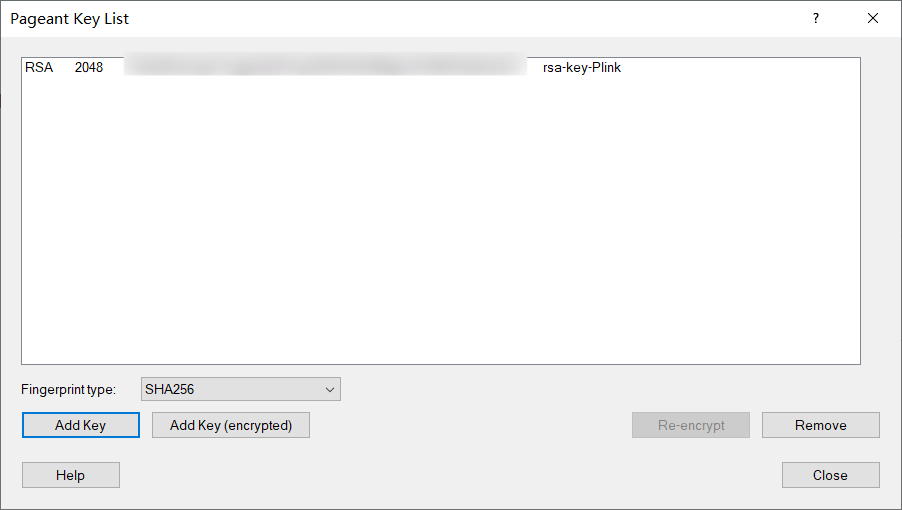

11、plink.exe 需要先手动信任 GitHub 的服务器密钥，Git 才能正常工作。在 Git Bash 中执行以下命令：
`TortoiseGitPlink git@github.com`——专门用于测试 TortoiseGit 能否正常连接 GitHub，检查你在 TortoiseGit 中配置的 PuTTY 密钥（.ppk）是否有效  
之后会弹出一个框，选择yes，这样就保存了github的主机密钥，认证成功
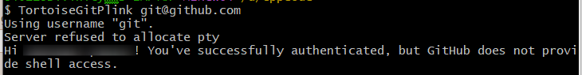

12、使用SSH进行clone，注意勾选上加载Putty密钥，选中.ppk私钥  
这个动作也会自动在pageant中加载私钥
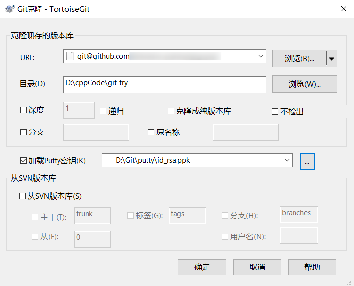

13、clone成功。后续进行pull、push等操作均会自动勾选上加载Putty密钥  
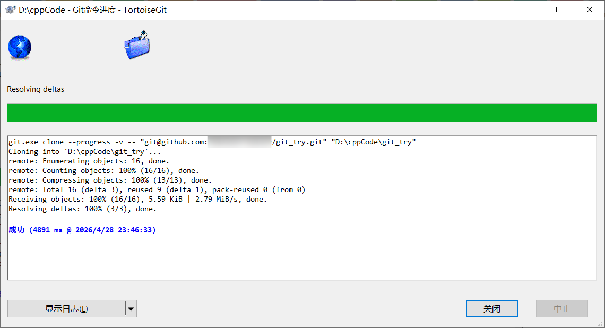
不勾选就会这样
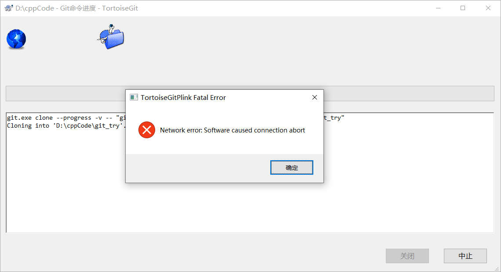
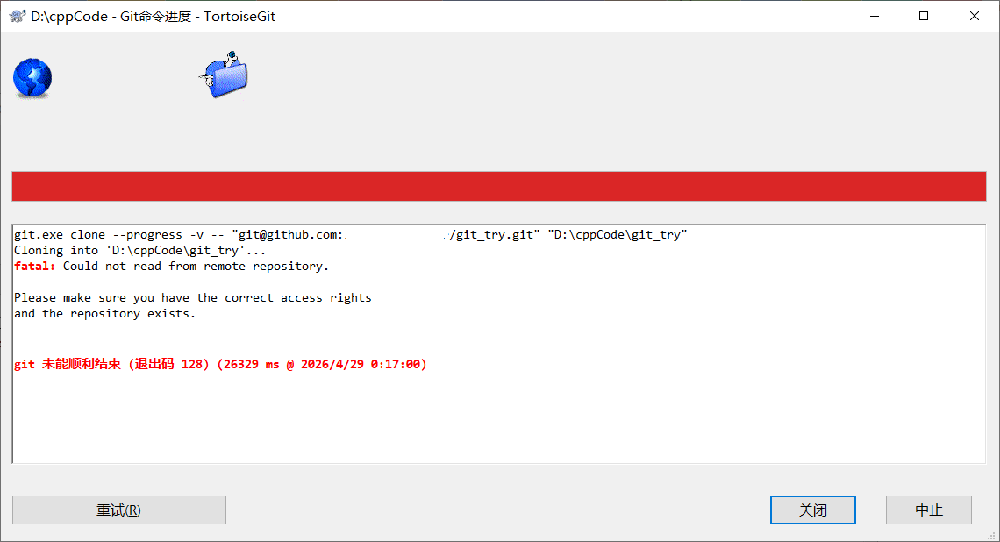